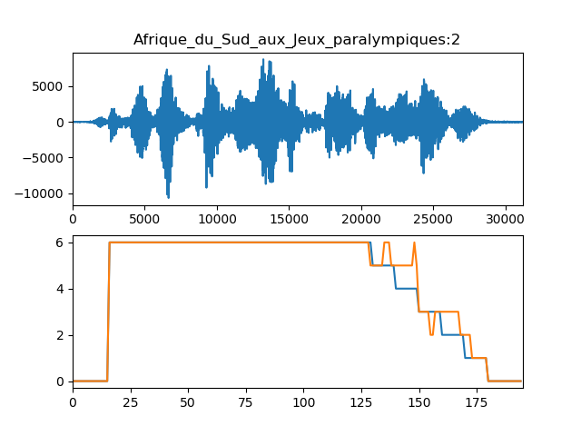

# The HOLISTIC challenge at Interspeech 2019

We are excited to invite participants to the **"How far is the end-of-utterance"** challenge!

The naming of the HOLISTIC challenge is a tribute to the seminal paper **“How long is the sentence?”** (Grosjean, 1983). 
The Swiss psycholinguist used gating experiments to show that listeners are capable to estimate the duration 
remaining of a sentence from its initial (gated) part without the help of sentential priors. 
He proposed that the information is in the prosody of the gated signal. 
These experimental results have been assessed by other methods such as button-press or brain responses.
A second derivation of the challenge name is the fact that determining the end of a contribution in speech grounds in many fields of linguistics, 
from prosody to syntax and semantics. It is for this reason that we find our challenge to be a particularly good match for 

**What about machines?** Prediction of End-of-Utterance (EoU), Sentence (EoS) and Turn (EoT) is an important component of natural speech and language processing for interactive systems, 
and in particular for incremental systems that shall initiate action even before an utterance is finished (e.g., start moving the head of a robot).
It is a prerequisite for timely backchanneling or turn taking. Several systems have already been proposed for incremental dialog systems. 
For some tasks, particularly embodied robotic systems, the **anticipation** of the end of utterance, rather than quick reaction to it, is particularly relevant.

The HOLISTIC challenge aims at gathering speech scientists and technologists around a common analysis and test bed, 
where analysis of performance of various predictive models on large data sets can be shared.

## Tasks
The task of the challenge is to incrementally estimate/anticipate how much material is sill missing until 
the end of the user utterance (EoU) (or user sentence, EoS) based on the audio that has been produced (and perceived) so far.
The aim is thus to go beyond a simple incremental Voice Activity Detector (VAD); 
each speech frame is complemented with its discretized distance to the EoU [5-valued cue]: 
(1) 0-49 ms; (2) 50-99 ms; (3) 100-199 ms; (4) 200-399 ms; (5) >400 ms until the end of the utterance; (0) no speech.
**In the evaluation, we will inform you of the precise distance of the frame 
so you may choose to outfit your solver to be more precise than the above-mentioned bins.**

The tasks consist in associating each 10ms signal frame (and the full signal leading up to this point) with one out of 6 labels: 
0 for silent frames, [1-5] for speech frames accprding to their relative distance from upcoming EoU (cf. Fig.1).
**You may also participate in a mode that skips 

 
Fig.1: Coding EoU prediction: 10ms frames are assigned one out of 7 labels [0-7]. Ground truth (blue steps) is coded according to VAD. Sample prediction is figured in red. The prepausal steps are 10 frames (i.e. 100ms) long. **Notice that we have since moved to logarithmic step sizes.**

## Tracks
You can compete in two tracks:
1. Purely signal-based EoU estimation. 
These end-to-end predictors should be language-independent and consider speech frames as input.
2. Language-specific EoS estimation. These predictors may exploit textual information
(as a proxy for incremental ASR results) that reflect what a system would be able to 
perceive at the given point in time in the middle of an utterance. Notice that the task 
here is to predict the end of the **sentence**, regardless of whether it is followed by silence.

## Data
In this first challenge, we focus on read speech. We will extend the task to dialogic, 
multimodal and/or multiparty conversation data in future iterations of the challenge.

We deliver data from the **Spoken Wikipedia Corpus** in several languages (English, French). We provide raw signals sampled at 16khz, in `.wav` format for French, and in the original `.ogg` format for other English. 

For **track 1**, the signal has been automatically parsed by a robust VAD and the results are available as `.TextGrid` files segmented into alternating silent intervals (labelled as `"__"`) and speech intervals (labelled as `"utt"`). **Notice that EN/DE VAD will be uploaded soon.**
 
For **track 2**, we use the alignments provided by the Spoken Wikipedia Corpus project. 
We focus exclusively on sentences that have been fully aligned (including phonetic alignments for all words).
Please use only the subset of the SWC distribution as is indicated below 
(we intend to sample the test data from the other, remaining articles).
The `SWC` annotation format is described in some detail in a recent [LRE article](https://nats-www.informatik.uni-hamburg.de/pub/User/TimoBaumann/Publications/lre-article.pdf); 
a JAVA implementation is available on the [SWC website](http://nats.gitlab.io/swc/), for parsing with Python see the example code below.

<ol type="A"><li>English data: <a href="https://www2.informatik.uni-hamburg.de/nats/pub/SWC/SWC_English.tar">SWC distribution</a> (16GB: audio and transcripts), 
<a href="english.train">english.train</a> (list of articles to train on)</li>
<li> French data: 10 hours <a href="https://drive.google.com/file/d/19RjZfzt5oPOWlOQXJRG36-TKpxSG-IG8/view?usp=sharing">Wikimedia_FR.tar.gz; 148 articles; 4.8GB</a></li>
<!--2. German data: 300 hours [.tar]-->
</ol>

## Participating
Please indicate your participation by filling this form and sending the resulting e-mail:

<form action="https://formspree.io/mail@timobaumann.de" method="POST">
<table>
  <tr><td>Name:</td><td><input type="text" name="name"/></td></tr>
  <tr><td>Affiliation:</td><td><input type="text" name="affiliation"/></td></tr>
  <tr><td>E-Mail:</td><td><input type="email" name="_replyto"/></td></tr>
  <tr><td>Scope of participation:</td></tr>
  <tr><td valign="top">Languages</td><td>
  <input type="checkbox" name="languages" value="EN"/>English 
  <input type="checkbox" name="languages" value="FR"/>French</td></tr>
  <tr><td valign="top">Types of inputs</td><td>
  <input type="checkbox" name="types" value="audio"/>Audio 
  <input type="checkbox" name="types" value="text"/>Text 
  <input type="checkbox" name="types" value="both"/>Syntax 
  <input type="checkbox" name="types" value="other"/>other:<input type="text" name="typeother"/></td></tr>
  <tr><td valign="top">Further comments:</td><td><textarea name="comments"></textarea></td></tr>
  <tr><td/><td><input type="submit" value="Send"/></td></tr>
</table>
</form> 

## Baseline software

We provide a baseline implementation for you to experiment with. Please see [https://github.com/timobaumann/HOLISTIC].

## Dissemination of the results
The results will be disseminated through the HOLISTIC Special Session at Interspeech 2019 (our special session proposal was accepted). 
Besides prediction scores, we ask each participant to send their system descriptions (but not necessarily code/scripts, although we encourage open science) - similar to the NIST SREs. 
We will submit a challenge summary paper to Interspeech, and  encourage the participants to submit papers describing their individual systems. This way the accepted papers would be available through the ISCA Archive in the Interspeech proceedings.

## Organizers

> **Timo Baumann**, Language Technologies Institute, Carnegie Mellon University, Pittsburg - USA

Dr. Baumann is a systems scientist at LTI/CMU with expertise in speech and 
prosody processing and is a leader in incremental processing for interactive systems. 
He has lead the Spoken Wikipedia Corpus collection project, which collected more than 
1000 hours of read speech from Wikipedia and produced corresponding alignments. 

> **Gérard Bailly**, GIPSA-lab, Grenoble-Alpes University, Grenoble - France

Prof. Bailly is a senior CNRS researcher at GIPSA-lab and
a specialist of speech communication. He was deputy director of the lab (2008-12). He supervised 28 PhD theses, authored 44 journal articles and 250 papers in major international conferencess and coedited “Talking Machines: Theories, Models \& Designs” (1992), “Improvements in Speech Synthesis” (2002) and “Audiovisual speech processing” (2012). His current interest is multimodal interaction with conversational agents (including the humanoid robot iCub).
